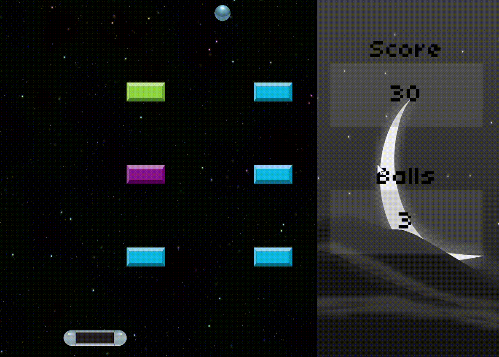
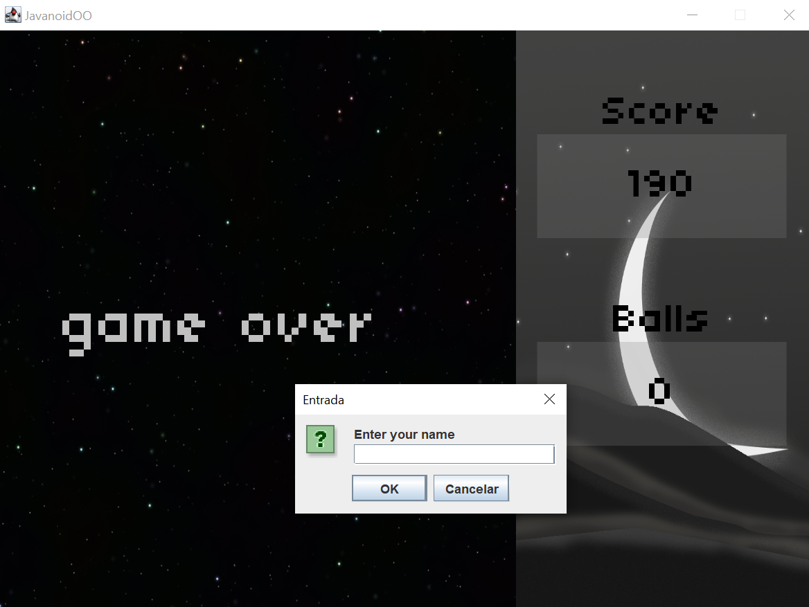
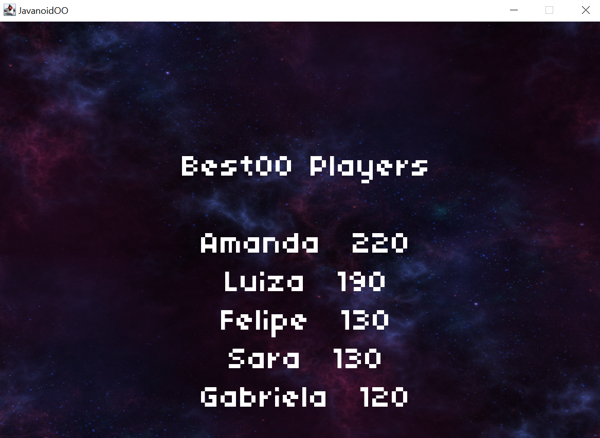
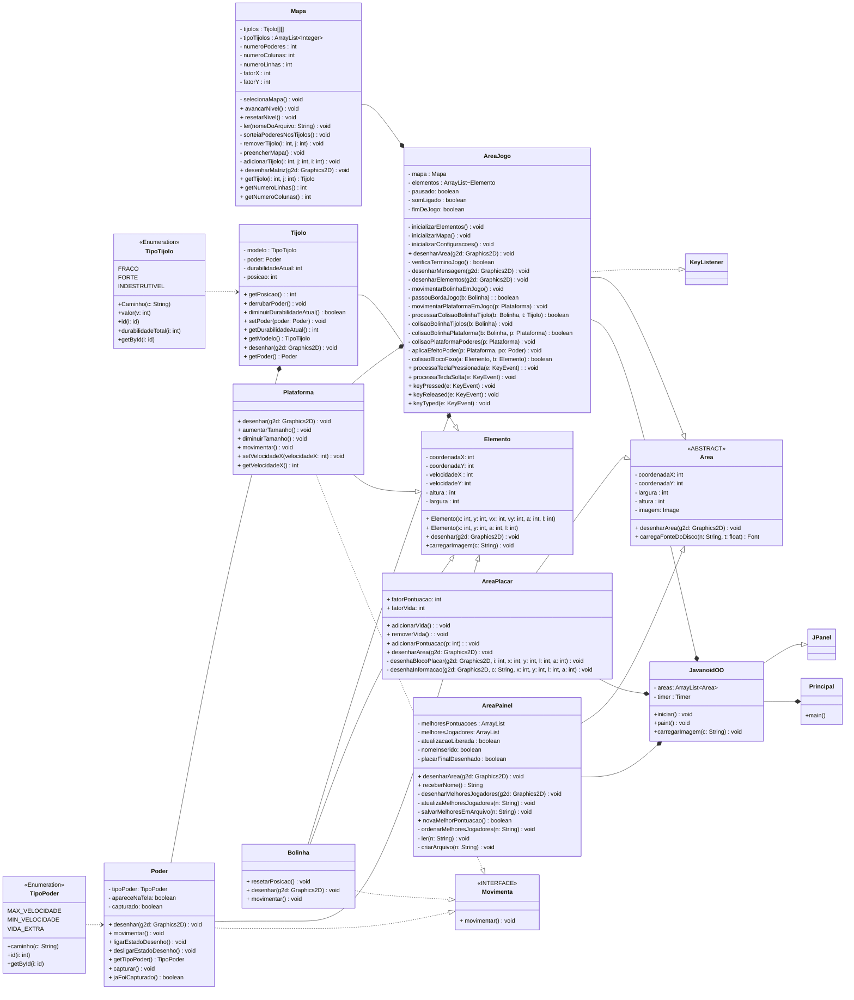

# JavanoidOO 🎮
> Autora: Luiza Kuze  
> Data: 13/12/2023  
> Projeto final de [POO](https://github.com/luizakuze/POO) 

## 📌 Descrição
[Paranoid](https://archive.org/details/msdos_Paranoid_shareware) é um jogo de computador para o sistema operacional DOS desenvolvido pelos irmãos Ben e Tom North (The Bit Bucket Brothers) durante suas férias escolares em 19921 sendo esse inspirado nos jogos Breakout (1976) e Arkanoid (1986). 

O jogo consiste em uma área de jogo retangular onde uma bolinha se movimenta rebatendo nas
paredes. O jogador controla uma plataforma que se movimenta horizontalmente na parte inferior da
área de jogo. O objetivo do jogo é fazer com que a bolinha rebata na plataforma e nas paredes para
quebrar os blocos que estão na parte superior da área de jogo. Se o jogador conseguir quebrar todos
os blocos, então ele passa para o próximo nível onde os blocos são dispostos de forma diferente. O
jogador tem 3 vidas para completar todos os níveis e perde uma vida quando a bolinha passa pela
plataforma e atinge a parte inferior da área de jogo.

O que torna o jogo interessante são os poderes que podem ser adquiridos ao quebrar determinados blocos. Por exemplo, ao quebrar um bloco pode ser liberado um poder com um símbolo de +
que se for capturado pelo jogador lhe da uma vida extra. Alguns poderes podem ser ruins, como por
exemplo, o poder com um símbolo de - que se for capturado pelo jogador faz com que a plataforma
diminua de tamanho. 

## 🎯 Objetivo
O objetivo deste projeto prático é implementar uma versão do jogo Paranoid em Java, uma versão do jogo utilizando java-swing.

## 🎥 Demonstração

_Jogo JavanoidOO_

## ✨ Requisitos em Destaque

Observe que o jogador tem a oportunidade de adquirir poderes e destruir tijolos durante o jogo, assim como no Paranoid. 

Os tijolos podem ser classificados como verdes, roxos ou azuis. Os tijolos verdes são indestrutíveis e contribuem para a pontuação sempre que a bola colide com eles. Por outro lado, tijolos de outras cores pontuam apenas quando são quebrados. Os tijolos azuis se quebram imediatamente após a colisão, enquanto os tijolos roxos requerem duas colisões para serem destruídos.

_Tipos de tijolos_

Além disso, há três tipos de poderes: um que aumenta o tamanho da plataforma, outro que a diminui e um terceiro que adiciona uma vida/bola extra ao jogador.

_Tipos de poderes_

Quando o jogador fica sem vidas, duas situações podem ocorrer: entrar para os cinco melhores jogadores locais (registrado no disco) ou não. 

Caso entre, uma janela é exibida para que ele registre seu nome e atualize o painel dos melhores jogadores.

_Atualização do painel de melhores jogadores_

Em ambas as situações, é exibido o painel final dos melhores jogadores locais.

_Painel de melhores jogadores_

## 📕 Controles
- **Espaço:** Pausa o jogo.
- **Teclas de Direção:** Movimentação da plataforma.
- **Q:** Sai do jogo.

## 📚 Requisitos funcionais do jogo
Aprofundando os detalhes sobre o funcionamento do jogo, esses foram os requisitos fornecidos pelo professor da disciplina.

- [x] **RF-1** O objetivo do jogo é fazer com que a bolinha rebata na plataforma e nas paredes para quebrar
os blocos que estão na parte superior da área de jogo.

- [x] **RF-2** O jogador deve controlar (pelo teclado) uma plataforma que se movimenta horizontalmente
na parte inferior da área de jogo.

- [x] **RF-3** O jogo deve ter uma área retangular onde uma bolinha se movimenta rebatendo nas paredes
e na plataforma controlada pelo jogador. A bolinha deve se movimentar em uma velocidade constante
e deve rebater nas paredes e na plataforma de acordo com as leis da física (colisão elástica).

- [x] **RF-4** Se o jogador conseguir quebrar todos os blocos, então ele passa para o próximo nível onde
os blocos são dispostos de forma diferente.

- [x] **RF-5** O jogador tem 3 vidas para completar todos os níveis e perde uma vida quando a bolinha
passa pela plataforma e atinge a parte inferior da área de jogo.

- [x] **RF-6** O jogo deverá ter no mínimo 4 níveis e se o jogador passar do último nível então ele volta
para o primeiro nível.

- [x] **RF-7** O jogo deverá ter no mínimo 3 tipos de blocos: blocos que podem ser quebrados com 1
rebatida da bolinha, blocos que podem ser quebrados com 2 rebatidas da bolinha e blocos que não
podem ser quebrados.

- [x] **RF-8** O jogo deverá ter no mínimo 3 tipos de poderes: poder que aumenta o tamanho da plataforma,
poder que diminui o tamanho da plataforma e poder que dá uma vida extra ao jogador.

- [x] **RF-9** A plataforma deve ter um tamanho inicial e deve ser possível aumentar ou diminuir o tamanho
da plataforma no máximo ou mínimo de 20% de seu tamanho original. Por exemplo, se o tamanho
inicial da plataforma for 100 pixels, então o tamanho mínimo da plataforma será de 80 pixels e o
tamanho máximo da plataforma será de 120 pixels. O poder que aumenta o tamanho da plataforma,
se capturado, não deve surtir efeito se o tamanho da plataforma já estiver no tamanho máximo. A
mesma ideia para o poder que diminui o tamanho da plataforma.

- [x] **RF-10** Cada nível deverá ter um número diferente de blocos e poderes. Os poderes devem ser
distribuídos aleatoriamente entre os blocos que podem ser quebrados. O número de poderes que
poderá ser liberado em cada nível deverá ser de no mínimo 3 e no máximo 5.

- [x] **RF-11** O jogo deverá ter um placar que mostra o número de vidas do jogador.

- [x] **RF-12** O jogo deverá ter um placar que mostra o nível atual do jogador.

- [x] **RF-13** O jogo deverá ter um painel com a pontuação dos 5 melhores jogadores (nome e pontuação) e deve ser exibido sempre que o jogador perder todas as vidas. O nome do jogador deve ser solicitado somente se a pontuação do jogador estiver entre as
5 melhores. Esse painel deve ser salvo em um arquivo na memória secundária (e.g. disco) de forma
que os dados sejam mantidos entre as execuções do jogo.

## 💡 Futuras Implementações 
- [ ]  Adicionar imagens de fundo distintas para cada tipo de nível, proporcionando uma experiência visual mais rica.
- [ ] Implementar efeitos sonoros para colisões da bolinha, interações com os blocos e momentos de finalização de jogo, criando uma atmosfera auditiva envolvente.
- [ ] Transformar os diferentes níveis do jogo em enumerações, simplificando o gerenciamento e facilitando futuras expansões.
- [ ] Introduzir novos tipos de poderes, como alterações na velocidade da bolinha em jogo, proporcionando desafios adicionais e estratégias diferenciadas.

## 📖 Diagrama UML 

## 📃 Referências
Todas as imagens e fontes incorporadas neste projeto foram obtidas de fontes que oferecem licenças de uso gratuito, garantindo conformidade legal e respeito aos direitos autorais. 

## 📜 Licença 

Este projeto é licenciado sob a [MIT License](https://github.com/luizakuze/JavanoidOO/blob/main/license)
