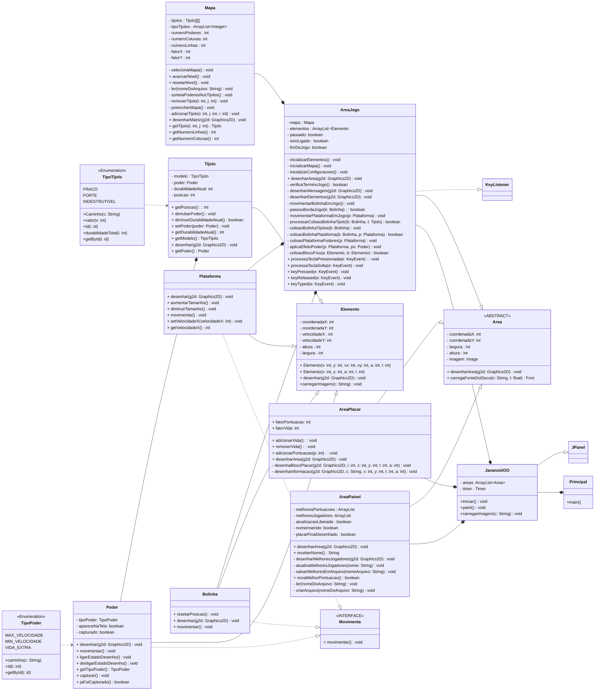

# JavanoidOO

```mermaid
classDiagram
    direction LR

    class Principal {
        +main()
    }


    class Mapa {
        - tijolos : Tijolo[][]                 
        - tipoTijolos :  ArrayList~Integer~
        - numeroPoderes :  int                   
        - numeroColunas:   int                   
        - numeroLinhas :  int                    
        - fatorX :  int                          
        - fatorY :  int                          
        - selecionaMapa() void               
        + avancarNivel() void                
        + resetarNivel() void                
        - ler(nomeDoArquivo: String) void    
        - sorteiaPoderesNosTijolos() void    
        - removerTijolo(i: int, j: int) void 
        - preencherMapa() void                
        - adicionarTijolo(i: int, j: int, i: int) void   
        + desenharMatriz(g2d: Graphics2D) void
        + getTijolo(i: int, j: int) Tijolo   
        + getNumeroLinhas() int               
        + getNumeroColunas() int  
   }

        class JavanoidOO {
        - areas:  ArrayList~Area~
        - timer : Timer                 
        +iniciar() void              
        +paint() void       
        +carregarImagem(c: String) void          
        }

   
    class TipoTijolo {
        <<Enumeration>>
        FRACO
        FORTE
        INDESTRUTIVEL
        +Caminho(c: String)
        +valor(v: int)
        +id(i: id)
        +durabilidadeTotal(i: int)
        +getById(i: id)
    }

    class Tijolo {
            - modelo : TipoTijolo
            - poder:  Poder
            - durabilidadeAtual:  int
            - posicao:  int
            + getPosicao():  int
            + derrubarPoder() void
            + diminuirDurabilidadeAtual() boolean
            + setPoder(poder: Poder) void
            + getDurabilidadeAtual() int
            + getModelo() TipoTijolo
            + desenhar(g2d: Graphics2D) void
            + getPoder() Poder
        }

    class TipoPoder {
        <<Enumeration>>
        MAX_VELOCIDADE
        MIN_VELOCIDADE
        VIDA_EXTRA
        +caminho (c: String)
        +id (i: int)
        +getById(i: id)
    }

class Poder {
        - tipoPoder: TipoPoder
        - apareceNaTela: boolean
        - capturado: boolean
        + desenhar(g2d: Graphics2D) void
        + movimentar() void
        + ligarEstadoDesenho() void
        + desligarEstadoDesenho() void
        + getTipoPoder() TipoPoder
        + capturar() void
        + jaFoiCapturado() boolean
    }


class Plataforma {
        + desenhar(g2d: Graphics2D) void
        + aumentarTamanho() void
        + diminuirTamanho() void
        + movimentar() void
        + setVelocidadeX(velocidadeX: int) void
        + getVelocidadeX() int
    }


   class Movimenta {
    <<INTERFACE>>
        + movimentar() void
    }

    class Elemento {
        - coordenadaX:  int
        - coordenadaY:  int
        - velocidadeX : int
        - velocidadeY:  int
        - altura : int
        - largura : int
        + Elemento(x: int, y: int, vx: int, vy: int, a: int, l: int)
        + Elemento(x: int, y: int, a: int, l: int)
        + desenhar(g2d: Graphics2D) void
        +carregarImagem(c: String) void

    }

    class Bolinha {
        + resetarPosicao() void
        + desenhar(g2d: Graphics2D) void
        + movimentar() void
    }

class AreaPlacar {
        + fatorPontuacao:  int
        + fatorVida:  int
        + adicionarVida() : void
        + removerVida():  void
        + adicionarPontuacao(p: int) : void
        + desenharArea(g2d: Graphics2D) void
        - desenhaBlocoPlacar(g2d: Graphics2D, i: int, x: int, y: int, l: int, a: int) void
        - desenhaInformacao(g2d: Graphics2D, c: String, x: int, y: int, l: int, a: int) void
    }

 class AreaPainel {
        - melhoresPontuacoes : ArrayList<Integer>
        - melhoresJogadores:  ArrayList<String>
        - atualizacaoLiberada : boolean
        - nomeInserido:  boolean
        - placarFinalDesenhado : boolean
        + desenharArea(g2d: Graphics2D)  void
        + receberNome() String
        - desenharMelhoresJogadores(g2d: Graphics2D) void
        - atualizaMelhoresJogadores(nome: String) void
        - salvarMelhoresEmArquivo(nomeArquivo: String) void
        + novaMelhorPontuacao() boolean
        - ler(nomeDoArquivo: String) void
        - criarArquivo(nomeDoArquivo: String) void
    }

class AreaJogo {
        - mapa : Mapa
        - elementos : ArrayList~Elemento
        - pausado: boolean
        - somLigado : boolean
        - fimDeJogo:  boolean
        - inicializarElementos() void
        - inicializarMapa() void
        - inicializarConfiguracoes() void
        + desenharArea(g2d: Graphics2D) void
        - verificaTerminoJogo() boolean
        - desenharMensagem(g2d: Graphics2D) void
        - desenharElementos(g2d: Graphics2D) void
        - movimentarBolinhaEmJogo() void
        - passouBordaJogo(b: Bolinha): boolean
        - movimentarPlataformaEmJogo(p: Plataforma) void
        - processarColisaoBolinhaTijolo(b: Bolinha, t: Tijolo) boolean
        - colisaoBolinhaTijolos(b: Bolinha) void
        - colisaoBolinhaPlataforma(b: Bolinha, p: Plataforma) boolean
        - colisaoPlataformaPoderes(p: Plataforma) void
        - aplicaEfeitoPoder(p: Plataforma, po: Poder) void
        - colisaoBlocoFixo(a: Elemento, b: Elemento) boolean
        + processaTeclaPressionada(e: KeyEvent): void
        + processaTeclaSolta(e: KeyEvent) void
        + keyPressed(e: KeyEvent) void
        + keyReleased(e: KeyEvent) void
        + keyTyped(e: KeyEvent) void
    }

class Area{
    <<ABSTRACT>>
    - coordenadaX:  int
    - coordenadaY:  int
    - largura : int
    - altura : int
    - imagem: Image
    + desenharArea(g2d: Graphics2D) void
    + carregaFonteDoDisco(n: String, t: float) Font
}

    JavanoidOO --* Principal

    AreaJogo --*JavanoidOO
    AreaPainel --* JavanoidOO
    AreaPlacar --* JavanoidOO

    AreaJogo --|> Area
    AreaPlacar --|> Area
    AreaPainel --|> Area

    Poder ..|> Movimenta
    Bolinha ..|> Movimenta
    Plataforma ..|> Movimenta

    AreaJogo ..|> KeyListener


    Tijolo --|> Elemento
    Poder --|> Elemento
    Bolinha --|> Elemento
    Plataforma --|> Elemento
    
    JavanoidOO --|> JPanel


    Bolinha --* AreaJogo
    Plataforma --* AreaJogo
    Mapa --* AreaJogo

    Poder --* Tijolo

    TipoTijolo ..> Tijolo
    TipoPoder ..> Poder

```
